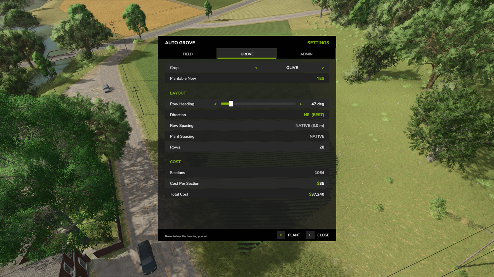
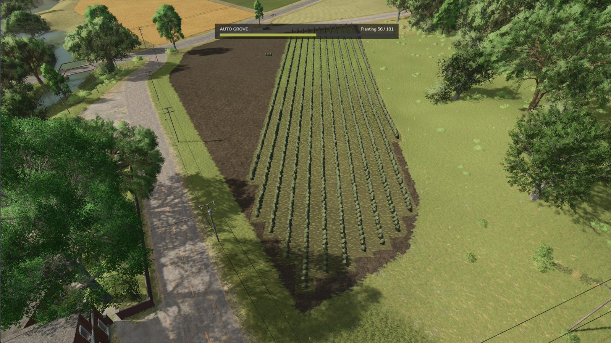
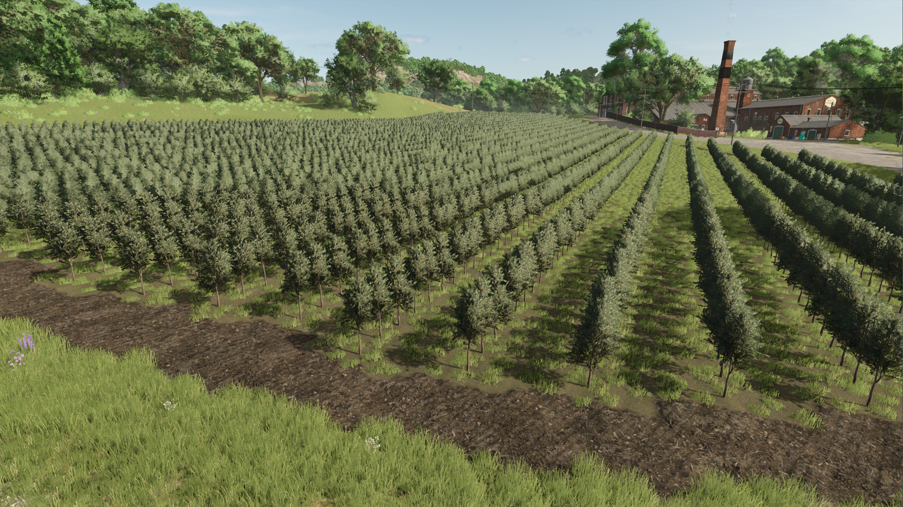
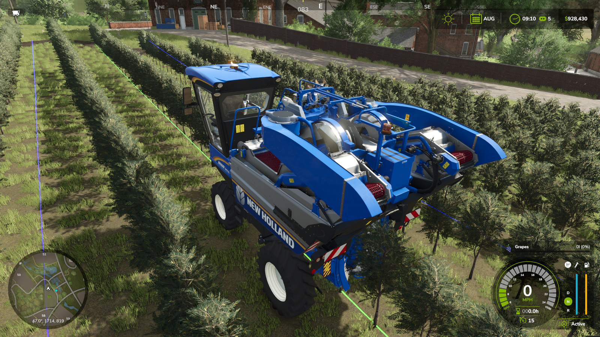
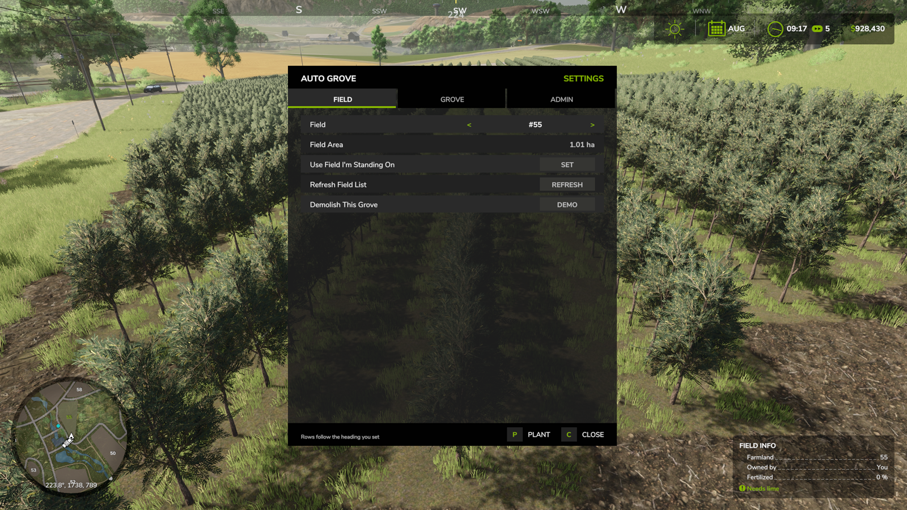
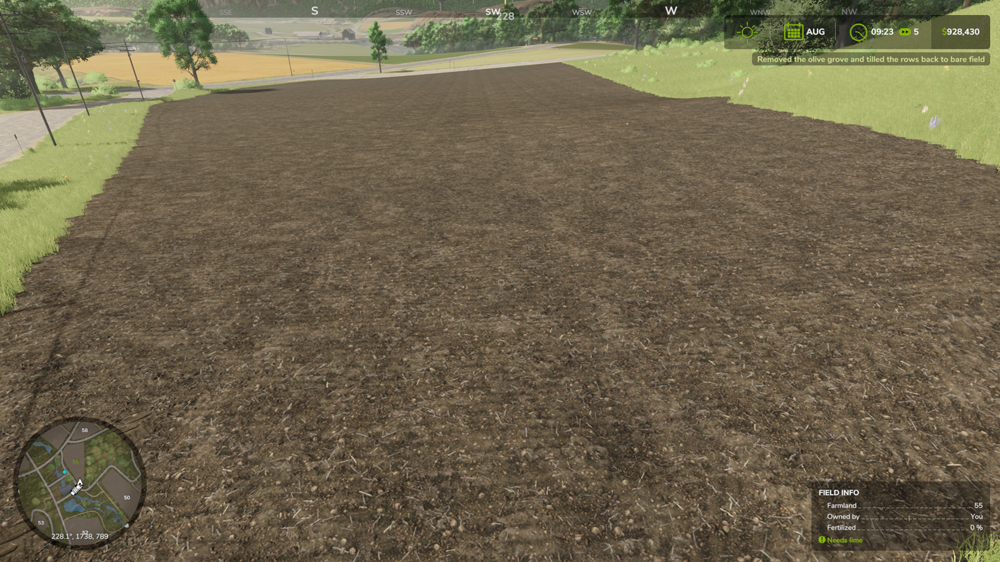

  

<h1 align="center">Auto Grove</h1>

<strong>Version 1.0.0.0</strong>

  <strong>Plant a whole vineyard or olive grove in one action — evenly spaced, aligned to your heading, and fitted to the shape of the field.</strong> 
  Built from the game's own orchard placeables, so the result is exactly what you would have built by hand.

  <a href="https://rocklandusa.com/"><strong>rocklandusa.com</strong></a> ·
  <a href="https://www.youtube.com/@rocklandusa">YouTube</a> ·
  <a href="https://www.twitch.tv/rocklandusa">Twitch</a> ·
  <a href="https://www.facebook.com/rocklandusa/">Facebook</a> ·
  <a href="https://discord.gg/ahWDGanNP5">Discord</a> ·
  <a href="https://github.com/RocklandUSA/FS25_AutoGrove/issues">Issues</a> ·
  <a href="https://github.com/RocklandUSA/FS25_AutoGrove/discussions">Discussions</a>

### ⏳ Submitted to the GIANTS ModHub — awaiting approval

*Auto Grove will be distributed exclusively through the official GIANTS ModHub. This page will be updated with the download link as soon as the mod is approved and live.*

---

## Quick facts

- **Author:** RocklandUSA Gaming
- **Game:** Farming Simulator 25 (Giants Engine descVersion 111)
- **Platform:** PC only — not available on console
- **Multiplayer:** Fully supported (also runs in singleplayer)
- **Dependency:** None — works entirely standalone
- **Permissions:** Farm Manager rights required to plant or demolish
- **Distribution:** Official GIANTS ModHub only — source is closed

## Overview

Auto Grove plants an entire vineyard or olive grove in a single action.

Pick one of your farm's fields, choose grapes or olives, set the direction you want the rows to run, and the whole grove is laid out for you — evenly spaced, aligned to your heading, and fitted to the actual shape of the field. No placing trellis sections one at a time for forty minutes.

The rows follow the field boundary, including irregular and concave fields, and the mod tells you exactly how many rows, how many sections, and what it will cost before you commit to anything.

  

▶ <a href="https://www.youtube.com/watch?v=eRqH_ftpRVk"><strong>Watch the Auto Grove trailer</strong></a>

  

Pick the field, pick the crop, set the heading — rows, sections and the exact cost are quoted before you commit to anything.

<table align="center">
  <tr>
    <td align="center" width="50%">
       
      Rows go in paced to the engine, with an on-screen progress bar you can watch while you carry on farming.
    </td>
    <td align="center" width="50%">
       
      The finished grove — built from the game's own orchard placeables at native spacing.
    </td>
  </tr>
  <tr>
    <td align="center" width="50%">
       
      Vanilla guidance steering works in an Auto Grove grove with no extra setup.
    </td>
    <td align="center" width="50%">
       
      The FIELD tab — pick a field, or just use the one you're standing in.
    </td>
  </tr>
  <tr>
    <td align="center" colspan="2">
       
      Changed your mind? One action removes the grove and tills the rows back to bare field.
    </td>
  </tr>
</table>

Everything is done through one in-game panel on **F6**. There are no console commands and nothing to edit in a text file.

---

## Features

### Planting

- **Whole-field planting in one action** — grapes or olives, laid out across any field your farm owns
- **Set the row direction in degrees** — a heading slider with a live compass readout, so rows run exactly the way you want them
- **Best-heading recommendation** — Auto Grove works out the most efficient angle for the field's shape and offers it as a one-tap **BEST** button
- **Live preview before you commit** — row count, section count, and total cost update as you change the heading
- **Follows the field boundary** — including irregular and concave fields, where a row crossing a notch is split into separate spans rather than bridged
- **Native spacing** — rows and plant spacing are read from the game's own orchard placeables, so the finished grove is identical to one built by hand
- **Automatic field clearing** — the previous crop, weeds, and stones are stripped and the ground is tilled to cultivated soil before the first row goes in

### Cost & permissions

- **Vanilla pricing** — the grove costs exactly what the same sections would cost placed by hand in the construction screen
- **Charged on completion, for what was actually placed** — a cancelled or failed job costs nothing
- **Server-set discount** — admins can set a discount from 0–100% to run groves as a cheaper service, or leave it at full price
- **Farm Manager rights required** — farm hands cannot reshape your fields

### Removal

- **Demolish a grove in one action** — removes the whole grove and tills the rows back to bare field
- **Two-tap confirmation** — the first tap arms it, the second performs it, so a stray click can never wipe a grove
- **Hand-built groves too** — not just groves this mod planted
- **Groves that cross field boundaries are trimmed, not destroyed** — only the rows standing on the selected field are removed, and the rows on neighbouring fields are left alone

### General

- **Multiplayer safe** — fully supported on dedicated servers, listen servers, and in single-player
- **Paced to the engine** — rows are fed to the game at a rate it can render, with an admin-adjustable build speed for lower-end machines
- **On-screen progress** — a progress bar shows the job running whether or not the panel is open, so you can close it and carry on farming
- **No console commands** — everything is in the F6 panel
- **Zero dependencies** — works entirely standalone

---

## Keybinds

| Action | Default | Notes |
|---|---|---|
| Open the Auto Grove panel | **F6** | Rebindable in Options → Controls |

**F6 is the shared settings key across all RocklandUSA Gaming mods.** If you have more than one of our mods installed, F6 opens a directory listing them and you pick the one you want. With only Auto Grove installed, F6 opens Auto Grove directly.

---

## The Panel

Press **F6** to open Auto Grove. The panel has two tabs, plus a third for admins.

### FIELD tab

| Row | What it does |
|---|---|
| **Field** | Cycle through every field your farm owns |
| **Field Area** | Size of the selected field in hectares |
| **Use Field I'm Standing On** — `SET` | Selects the field you're currently standing in |
| **Refresh Field List** — `REFRESH` | Re-scans your owned fields, for when you've just bought one |
| **Demolish This Grove** — `DEMO` | Removes the grove on this field and tills it back to bare soil (two-tap confirm) |

### GROVE tab

| Row | What it does |
|---|---|
| **Crop** | Grapes or olives |
| **Row Heading** | The direction rows run, 0–359° in 5° steps |
| **Direction** | Shows the current bearing. Carries a **(BEST)** marker when you're on the optimal angle, and becomes a one-tap **BEST** button when you aren't |
| **Row Spacing** | Fixed at the game's native orchard spacing (3 m) |
| **Plant Spacing** | `NATIVE` — set by the game's own orchard placeable |
| **Rows** | How many rows will be built |
| **Sections** | How many pole-to-pole spans in total |
| **Cost Per Section** | The vanilla rate this is priced from — $25 grapes, $35 olives |
| **Discount** | Only shown when a server has set one |
| **Total Cost** | What the farm will actually pay |
| **Plantable Now** | Whether the crop can be planted at the current time of year |

The rows are grouped under **LAYOUT** and **COST** headings, so the price is auditable rather than a single number to take on trust: rate × sections, less any discount, equals total.

Selecting a new field automatically snaps the heading to that field's best angle, so the default is always a sensible one.

### ADMIN tab

Visible only to admins and the host. Settings are saved on the server and apply to everyone.

| Setting | Default | Description |
|---|---|---|
| **Cost Discount** | 0% | Percentage off the vanilla grove price, 0–100 |
| **Respect Planting Season** | On | When on, grapes can only be planted during the game's plantable period |
| **Build Speed** | NORMAL | How gently rows are fed to the engine — FAST, NORMAL, SLOW, or VERY SLOW |

---

## Cost

Auto Grove charges exactly what the game charges for placing the same sections by hand:

| Crop | Price per section |
|---|---|
| Grapes | $25 |
| Olives | $35 |

A *section* is one pole-to-pole span of the orchard placeable — 3 metres on stock maps. The total is quoted in the GROVE tab before you commit, and the farm is only charged once planting completes, for the sections that actually went in.

If your farm can't afford the grove, the panel says so and the job won't start.

Server admins can apply a discount of 0–100% from the ADMIN tab, which applies to everyone on the server.

---

## Permissions

Planting and demolishing both require **Farm Manager** rights. This is deliberate — creating or removing a grove permanently reshapes a field and costs the farm money, which isn't something a farm hand should be able to do.

Admin rights are *not* required to plant. Only the ADMIN tab (server settings) is restricted to admins and the host.

---

## Build Speed

Farming Simulator builds fence and trellis sections from an internal queue that it drains at a fixed rate. Feed it faster than that and rows arrive with collision but no visible mesh — an invisible wall you can't walk through.

Auto Grove paces itself to that rate. The default (**NORMAL**) is verified good in multiplayer with plenty of headroom. If you're running a server with lower-end clients and see rows arriving invisible, drop the build speed to SLOW or VERY SLOW in the ADMIN tab.

---

## Installation

Auto Grove is distributed exclusively through the official **GIANTS ModHub**.

1. Once approved, open the in-game Mod Hub menu in Farming Simulator 25, search for **Auto Grove**, and subscribe — or download the mod zip from the ModHub page and place it (do not extract) into your mods folder at `Documents\My Games\FarmingSimulator2025\mods\`.
2. Launch the game and enable the mod in the mod menu.
3. Press **F6** in-game to open the panel.

**This repository contains documentation and issue tracking only.** The mod source code is closed and is not distributed outside of ModHub. Pull requests to add code will not be accepted.

---

## Multiplayer

Auto Grove is multiplayer-safe by design, not as an afterthought.

- All planting and demolition is validated and performed **on the server**. A client asks; it never instructs.
- Field ownership, Farm Manager rights, and affordability are re-checked server-side on every request, regardless of what the client sent.
- Rows replicate to every client through the game's own placeable networking.
- Server settings (discount, season, build speed) live on the server and apply to everyone.
- Works on dedicated servers, listen servers, and in single-player.

---

## Guidance Steering & AI Helpers

A grove built by Auto Grove uses the game's own orchard placeables, so it behaves exactly like one built by hand. That has two consequences worth knowing about.

### Guidance steering works

Vanilla **steering assist** works in Auto Grove groves with no extra setup.

Where the guidance line falls depends on the implement you're using, because Farming Simulator classifies vineyard tools into two kinds:

- **Harvesters** — the ERO Grapeliner, Gregoire GL86, and New Holland Braud 9070L / 9090X straddle the vine row and drive *over* it, so the guidance line sits **on the row**. That's correct behaviour for those machines.
- **Between-row tools** — the Berthoud WinAir 1000, Hardi Mercury 4000L, Provitis MP 122 OCEA, Agrisem Disc-O-Vigne V, and TMC Cancela TPN140 drive down the alley, so the line sits **in the alley centre**.

All of them are in the **`grapeTools`** store category. An ordinary field sprayer has no vineyard classification at all, so the game generates a plain field course with no knowledge of where your rows are — the lines will fall wherever the boom width puts them, often straight through the plants. If your guidance lines look wrong, check that you're using a vineyard-classified implement.

One gotcha: a sprayer reports a real working width, so the course won't regenerate while you stay on the field. If you swap implements mid-field, drive off the field and back on to force a fresh course.

### AI helpers do not work in vineyards

This is a **base-game limitation, not an Auto Grove one**. Farming Simulator 25 refuses to run a hired worker on a vineyard course and stops the job with its own built-in "vineyard not supported" message. It does this in any vineyard, including one you build entirely by hand in the construction screen.

Auto Grove cannot change this, and no mod can grant it without replacing the game's field-work AI wholesale. Steering assist is unaffected — you can drive the rows yourself with guidance.

---

## Compatibility

| | |
|---|---|
| **Game** | Farming Simulator 25 |
| **Distribution** | Official GIANTS ModHub (pending approval) |
| **Multiplayer** | Fully supported |
| **Dedicated server** | Fully supported |
| **Dependencies** | None |
| **Conflicts** | None known |

Auto Grove works on any map with the standard orchard placeables, which includes all stock maps. Grapes and olives are fence-style placeables in Farming Simulator 25 rather than trees, and Auto Grove uses the game's own versions of both.

---

## Frequently Asked Questions

**Does this work on modded maps?**
Yes, on any map that ships the standard orchard placeables — which is effectively all of them, since the mod uses the base-game grape and olive placeables rather than map-specific ones.

**Can I plant on a field I don't own?**
No. Auto Grove only lists fields your farm owns, and the server re-checks ownership before doing anything.

**What happens to the crop that's already growing there?**
It's cleared first. The field is stripped of fruit, weeds, and stones, and tilled to cultivated ground before the first row is placed.

**Can I undo it?**
Yes — the **Demolish This Grove** button on the FIELD tab removes the grove and tills the rows back to bare field. It takes two taps to confirm.

**Will it work with CoursePlay?**
The grove is built from the game's own orchard placeables at native spacing, so it's indistinguishable from a hand-built one to any other mod.

**Why is a grove more expensive than I expected?**
Because it's priced at exactly the vanilla rate — $25 per grape section, $35 per olive section — and a full field holds a lot of sections. The GROVE tab quotes the total before you commit. Server admins can apply a discount.

**Some rows are invisible but I can't walk through them.**
Lower the **Build Speed** in the ADMIN tab. This happens when rows are fed to the engine faster than it can render them, which is more likely on lower-end machines. Demolish the grove and replant at a slower speed.

---

## Changelog

### 1.0.0.0 — Initial public release

- Whole-field vineyard and olive grove planting on any field your farm owns
- Row heading in degrees with a live compass readout and a best-angle recommendation
- Live preview of row count, section count, and total cost before committing
- Boundary-following row layout, including irregular and concave fields
- Native orchard spacing read from the game's own placeables
- Automatic field clearing to cultivated ground before planting
- Vanilla pricing, charged on completion for what was actually placed
- Server-set cost discount, 0–100%
- Farm Manager permission requirement
- One-action grove demolition with two-tap confirmation, tilling the field back to bare soil
- Admin-adjustable build speed for lower-end systems
- Planting-season toggle
- Full multiplayer support, server-authoritative throughout
- Shared **F6** settings panel across all RocklandUSA Gaming mods

---

## Credits

**Author:** RocklandUSA Gaming

Auto Grove is built and maintained by RocklandUSA Gaming. Bug reports and feature requests are welcome on the [issue tracker](../../issues).

- **YouTube:** [@rocklandusa](https://www.youtube.com/@rocklandusa)
- **Twitch:** [rocklandusa](https://www.twitch.tv/rocklandusa)
- **Discord:** [Join the community](https://discord.gg/ahWDGanNP5)
- **Website:** [rocklandusa.com](https://rocklandusa.com)

---

## License

Auto Grove is proprietary software. See [LICENSE](LICENSE) for full terms.

The documentation in this repository may be freely quoted and linked. The mod itself may only be distributed through the official GIANTS ModHub.
